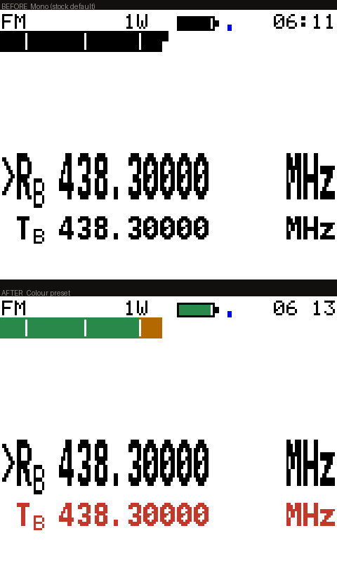
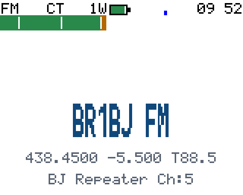
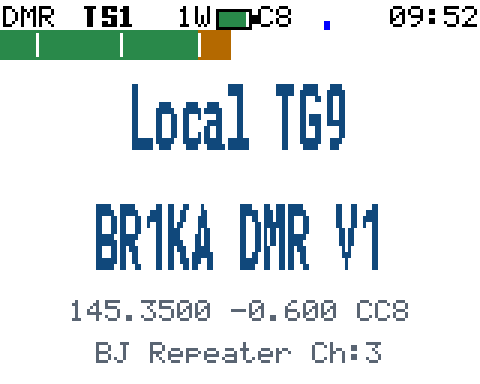
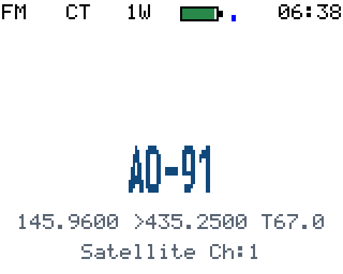
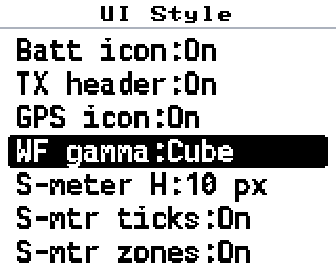
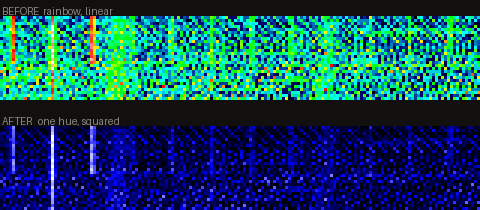
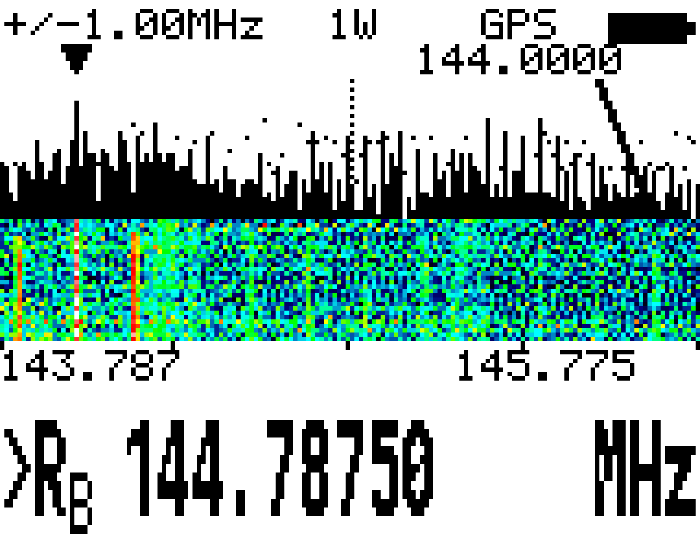
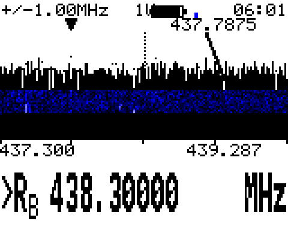
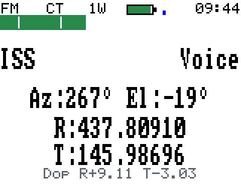
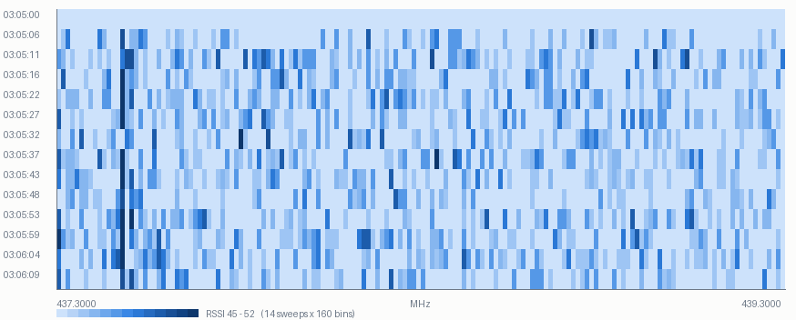

# md-uv390-plus-firmware

给 **TYT MD-UV390 Plus 10W（带 GPS）** 的一个 OpenGD77 定制构建，
以及一套能让电脑直接刷机、抓屏、刷星历、跑频段日志的主机工具。

界面上的改动都是**量出来的**，不是拍脑袋：信道屏 63% 的面积是空的、
彩屏被当成单色屏用、瀑布图的调色板把底噪画得比信号还亮 —— 一条条改掉。

> **这不是 OpenGD77 官方发布，也不是它的分支替代品。**
> 上游是 [OpenGD77](https://opengd77.com)，本项目与其作者**无从属、赞助或背书关系**。
> 有问题请在本仓库提 issue，别去打扰上游。

---

## ⚠️ 先读这三条

1. **发射需持有效业余执照并使用本人呼号。** 本固件**没有内置发射限制** ——
   频段、功率、带宽的合规由你自己负责。
2. **本构建带 AES-256 加密语音**（`ENABLE_AES`，继承自上游 fork）。
   **业余频段上加密通信在绝大多数国家和地区是禁止的，中国也在其列。**
   不需要就去掉这个开关自己编译，其余功能一个都不少。
3. **刷之前先备份整块 16 MB SPI flash。** 里面有出厂校准，每台唯一、丢了补不回来。
   步骤见下面「备份」。

完整的法律、商标与第三方声明在 [`NOTICE.md`](NOTICE.md)，授权在 [`LICENSE.txt`](LICENSE.txt)
（BSD 三条款 **+ 禁止商业使用**）。

---

## 机型

只针对 **MD-UV390 Plus 10W GPS** 这一个变体构建（`PLATFORM_MDUV380` +
`PLATFORM_VARIANT_UV380_PLUS_10W`）。别的 OpenGD77 机型请用官方固件。

| | |
|---|---|
| MCU | STM32F405VG |
| 屏 | 160×128 彩色 TFT（HX8353E，大端 RGB565）|
| 射频 | AT1846S（FM/FSK）+ HR-C6000（DMR 基带）|
| 外挂 flash | 16 MB SPI |
| 上游基线 | OpenGD77 **R20260131** |

---

## 加了什么

每个功能一个编译开关，**默认关闭；关掉时与官方固件行为等价**。
发布的二进制带下表里标「✅」的那些。

| 开关 | 功能 | 发布包 | 状态 |
|---|---|:--:|---|
| `ENABLE_THEME_PRESET` | 配色预设（Mono / Colour / Custom）| ✅ | 实机验收 |
| `ENABLE_INFO_DENSITY` | 信道信息行 + 表头功率染色 | ✅ | 实机验收 |
| `ENABLE_UI_STYLE` | 界面样式 7 项可调 | ✅ | 实机验收 |
| `ENABLE_WATERFALL` | 瀑布图 + 频率标尺 | ✅ | 实机验收 |
| `ENABLE_FAST_SCAN` | 模拟扫描加到 6 ms | ✅ | 已编译，未做对比实测 |
| `ENABLE_DOPPLER_READOUT` | 卫星多普勒偏移读数 | ✅ | 实机逐位核对 |
| `ENABLE_BAND_LOG` | 频段占用日志器 | ✅ | 实机 14 条 |
| `ENABLE_AES` | AES-256 加密语音（上游 fork）| ✅ | **只确认菜单能开，收发未实测** |
| `ENABLE_DMR_DATA` | DMR 短信 | ✅ | **只确认菜单能开，收发未实测** |
| `DISABLE_SAT_ALARM` | **删掉**上游的卫星过境闹钟 | ✅ | 见「已知限制」|
| `ENABLE_KEY_INJECTION` | 远程屏幕 + 按键注入 | ✖ | dev 用；与 AES 同开会 RAM 溢出 104 字节 |
| `ENABLE_SPECTRUM` | USB 驱动的扫频接收 | ✖ | dev 用，未转正 |

### 配色预设

上游 `themeInitToDefaultValues()` 把 32 个主题项**全设成同一组前景色**，
所以这块彩屏出厂跑起来跟它移植来源的单色 GD-77 一模一样（实测整屏只有 2 种颜色），
固件里那些按语义命名的颜色（电池绿/黄/红、S 表分段）全被压成黑。

`Options → Theme Options → Colour:` 切 `Mono / Colour`，左右键即时预览，**SK2+绿**存盘。



只改前景色是**设计决定**：三个背景项染了都会出事（标题栏逐字符背景方块、
表头字间露白、选中行反色把文字色当底盖上去），理由写在 `NOTICE` 之外的
[`docs/ROADMAP.md`](docs/ROADMAP.md) 里。预设表全是 `const`，**RAM 零开销**。

### 信道信息行

量出来的：FM 信道屏 **63%**、DMR 信道屏 **46%** 完全空白，最大空洞 24 行，
而且**信道屏根本不显示频率** —— 一个信道就只是一个名字。

在那个洞里补一行：下行频率 · 差频（或上行绝对频率）· 上行亚音（或 DMR 色码）。

| FM 中继 | DMR | 卫星（跨波段）|
|---|---|---|
|  |  |  |

- 亚音**优先显示 TX**，没有才退回 RX，用 `T` / `R` 前缀标明 ——
  RX 亚音只决定你听到什么，**TX 亚音才是开中继的那个**。
- 差频 ≥ 10 MHz 直接显示上行绝对频率（跨波段算差频没意义）。
  10 MHz 盖得住所有业余中继差频，最宽的 70cm 是 7.6 MHz。
- 表头功率按响度染色，**文字保留** —— 换成纯色块就不知道是 1W 还是 5W 了。

顺带修掉一个上游没有、本项目自己引入又自己发现的 bug：DMR 表头的色码（x 86–98）
被早先版本的电池图标（x 84–103）**无声擦掉**。现在电池占 10 px 挪到 x=72，
两端留白，越界用 `_Static_assert` 钉死。

### 界面样式（7 项可调）

`Options → Theme Options → UI Style`，**SK2+绿**存盘。



S 表高度 4–10 px、S1–S9 刻度（上游写好了但被 `#if 0` 封着）、按强度分段着色、
电池图标取代百分比文字、发射时表头染色、GPS 信号格取代 "GPS" 三个字母、瀑布图 gamma。

存在自己的自定义数据块（类型 9），**不**挂在 THEME_DAY/NIGHT 后面 ——
那两块是按固定长度数组读回的，加长会让已经存过颜色的人升级后设置失效。

### 瀑布图

VFO 下**长按 `#`** 进频谱扫描，trace 下方 28 行滚动历史 + 频率标尺。

原来是经典 jet 彩虹。彩虹对「量级」是**错的编码**：它不是感知均匀的，
而且**最亮的区域在中段** —— 实测 2m 底噪占 level 5–38、中位 19，
正好被涂成满饱和青绿，真载波淹在里面。改成单色阶 黑→蓝→白，亮度随量级单调递增。



同一批真实数据走两套映射（屏幕上每个瀑布像素都能反查回 level，不用刷机就能对比）。
实机效果：

| 旧（彩虹 + 线性）| 新（单色阶 + 平方律）|
|---|---|
|  |  |

底噪中位从 19/63 降到 7/63，峰值标记自己读出 437.7875 MHz。
gamma 三档在 UI Style 里选，**没有哪一档普遍更好** ——
安静的波段用 Linear 能用满色阶，吵的用 Square / Cube 才压得住底噪。

### 卫星多普勒读数

追踪屏底部一行 `Dop R+9.11 T−3.03`：两个波段各被推了多少 kHz、往哪个方向。



上面的修正后频率回答「调到多少」，这一行回答「**我在过境的哪一段**」——
偏移开始时最大、最近点过零、之后反向，光看修正后的频率看不出趋势。
两路符号相反、量值按频率比不同，这也是这一屏上唯一能确认上行也在被修正的地方。

### 频段占用日志器

把每一轮扫描（160 个 RSSI 采样 + 时间 + GPS 定位）记进 16 MB flash 的**最后 2 MB**，
循环覆盖，188 字节一条约 11150 条。挂在扫描回卷点上，**零额外 RAM**。



实机 14 轮，437.300–439.300 MHz，那条竖线是 437.4750 MHz 的稳定信号
（14 轮里 11 轮是峰值，RSSI 51–55 对底噪 45）。

> 与 NMEA 定位日志**共用那 2 MB，运行时互斥**。

---

## 下载与校验

固件在 [Releases](../../releases)。**自签名的东西请自己核对哈希再刷。**

| 文件 | 给谁 | SHA-256 |
|---|---|---|
| `md-uv390-plus-firmware-20260921.zip` | CPS 的 Firmware loader | `258a885ca9619175a090ca11792efcb91b33765247606cd9a523671457a750ca` |
| `md-uv390-plus-firmware-20260921.bin` | 本仓库的 `tools/flash.py` | `7f62e6ce1eab174c2c5a069019df3aa6f8544a545a7ab607fe575bfcd9f8907d` |

```bash
sha256sum md-uv390-plus-firmware-20260921.zip
# Windows PowerShell: Get-FileHash .\md-uv390-plus-firmware-20260921.zip -Algorithm SHA256
```

---

## 备份（刷之前做，不是可选项）

电台里有三层存储，能不能救回来完全不同：

| 存在哪 | 装着什么 | 丢了怎么办 |
|---|---|---|
| MCU 内部 flash | bootloader + 固件 | **随便丢**，重刷就是 |
| **外挂 16 MB SPI flash** | **校准（`0x8f000`）**、码表、主题、卫星星历 | **校准每台唯一，补不回来** |
| Secure Registers | 安全寄存器 768 字节 | 顺手备了 |

电台**正常开机**（不是 DFU）、关掉别的占串口的程序，
CPS → `Extras → OpenGD77 Support` → 依次备份 **Calibration / EEPROM / 整块 Flash**。
16 MB 实测约 **31 KB/s、9 分钟**，中途别拔线。

**好消息：刷固件只写 MCU flash，碰不到外挂 flash。** 所以换固件版本时码表、主题、
UI Style、星历全都不丢。这边核对过：刷了十几版之后整块读回来，
**校准区那 1 KB 与改动前逐字节相同**。

**别浪费时间试的事：原厂 TYT 固件备份不出来**，MCU 开了读保护，读出来是垃圾。

---

## 怎么刷

### 路线 A：CPS（官方路子，推荐第一次用）

1. 关机，按住 **SK1 + PTT** 再开机进 DFU（屏幕不亮是正常的，DFU 没有界面）
2. CPS → `Extras → Firmware loader`，选 `.zip`
3. **donor 选一份 TYT MD-9600 固件**，必须看到 `Patching for DMR`

> **为什么要 donor**：DMR 语音要 AMBE 编解码器，那是第三方专有代码，
> OpenGD77 和本仓库都**不分发**它 —— 发布的 `.bin` 里那 297904 字节全是 `0xFF`
> （自己验：偏移 `0x6937C` 起 `0x48BB0` 字节）。
> 烧录器从**你自己那份 MD-9600 固件**里取出来拼进去。这份 donor 你得自己有。

### 路线 B：`tools/flash.py`（能回读校验）

需要把 DFU 设备的驱动换成 WinUSB（Zadig），**代价是 CPS 的 Firmware loader 和 DfuSe
就刷不了了**（可以换回去）。完整步骤、为什么非换不可、怎么恢复，都在
[`docs/flashing.md`](docs/flashing.md)。

```bash
pip install pyserial libusb-package pillow

python tools/flash.py 固件.bin            # 预检，不写入
python tools/flash.py 固件.bin --yes      # 真刷
python tools/flash.py 固件.bin --verify   # 从 MCU ROM 回读 5 处 × 2048 字节比对
```

> **电台自报的「编译于」时间不可信** —— 它来自 `__DATE__`，增量构建时那个文件没重编。
> 要确认电台上跑的是哪一版，只能用 `--verify`。

---

## 自己编译

```bash
# 工具链：Arm GNU Toolchain 14.2.Rel1（arm-none-eabi-gcc）
cd firmware/MDUV380_firmware
rm -rf build                      # 换开关必须清，make 不跟踪开关变化
make -j8 ENABLE_AES=1 ENABLE_DMR_DATA=1 ENABLE_WATERFALL=1 \
         ENABLE_FAST_SCAN=1 ENABLE_UI_STYLE=1 ENABLE_BAND_LOG=1 \
         ENABLE_THEME_PRESET=1 ENABLE_INFO_DENSITY=1 \
         DISABLE_SAT_ALARM=1 ENABLE_DOPPLER_READOUT=1
python ../../tools/package_fw.py build/openuv380-10w.bin   # 要用 CPS 刷才需要打 zip
```

**不加 `ENABLE_AES=1` 就是一版不带加密的固件**，其余功能完全一样。

两条会浪费你半天的坑：

- **换编译开关必须 `rm -rf build`。** `make` 只看源文件时间戳，不看开关，
  否则会得到混合构建（部分 `.o` 还带着上一轮的开关）。
- **别拿 `size` 的 text 判断代码变没变。** 不同配置编出来 text 全是 728864 ——
  AMBE 占位段被链接脚本钉在**固定结束地址**，`.text` 长一点它就短一点，两者之和恒定。
  **代码变没变看 md5，装不装得下看 RAM。**

构建**不是位级可复现**的：`__DATE__` / `__TIME__` 和 git 版本号会编进去。

### 内存

两块 RAM 都快满了，**这是所有改动的前提**。发布这一版编完剩
**RAM 1604 字节 / CCM 236 字节**。纯绘图改动（用已有的 40 KB 帧缓冲）不吃 RAM；
新增全局变量或缓冲区必须先腾地方 —— 瀑布图的 64 项调色板 LUT 占 128 字节 bss，
就直接把链接撑爆过，改成实时计算才过。

---

## 主机工具

都在 `tools/`，Python 3 + `pyserial`。控制端跑起来后浏览器开 `127.0.0.1:8390`。

| 脚本 | 干什么 |
|---|---|
| `flash.py` | 刷机 + **回读校验**（`--list` / `--dfu` / `--yes` / `--verify`）|
| `sat.py` | 卫星星历：`list` / `dump` / `refresh` / `addfm` |
| `ogd77.py` / `ogd77_ctl.py` / `ogd77_write.py` | CPS 协议：读任意区段 / 发命令 / 写信道 |
| `ogd77_server.py` + `ui/` | 本地控制端 |
| `ogd77_screen.py` | 抓屏（**任何固件都能抓**）+ 按键注入（需 `ENABLE_KEY_INJECTION`）|
| `drive.py` | 按一串键并每步截图 |
| `wf_preview.py` | 从当前屏幕反查 level、渲染新旧配色对比，**不用刷机** |
| `bandlog.py` / `render_bandlog.py` | 频段日志解码与出图 |
| `package_fw.py` | 把 `.bin` 打成 CPS 能刷的固件 zip |

`sat.py` 大概是对别人最有用的一个：电台的星历会过期（**每老一周，过境预报差约一分钟**），
而它既不知道自己多旧、也从不说。

```bash
python tools/sat.py list              # 装了哪些、各自多旧
python tools/sat.py refresh --yes     # 从 CelesTrak 拉新星历写回
python tools/sat.py addfm --yes       # 空槽位填 FM 转发卫星
```

星表是码表里 **25 个固定槽位**，槽位数改不了；TLE 是**半字节压缩**存的，
每字节两个 nibble 查表 `0123456789. +-*`。写之前会做编码→解码→比对的往返自检，
名字对不上的会报出来、**不静默跳过**。

---

## 已知限制

- **AES-256 和 DMR 短信都只确认了菜单能打开，收发没测过。** 要两台机器才能测，
  这边没有。别把它们当成「能用」。
- **卫星过境闹钟被整个编译掉了**（`DISABLE_SAT_ALARM`）。
  不是因为它坏了，而是**没法验证**：彩屏平台上 `uiNotificationRefresh()` 推完屏会立刻
  把帧缓冲还原，**远程抓屏结构性看不见任何通知**，这边所有验证手段都是抓屏。
  卫星屏其余一切照旧：过境预报、极坐标跟踪、多普勒修正后的收发频率都在。
  想要闹钟就去掉这个开关自己编译。
- **`ENABLE_KEY_INJECTION` 和 `ENABLE_AES + ENABLE_DMR_DATA` 装不下**，一起开 RAM 溢出 104 字节。
- **瀑布图历史只有 28 行**，存不下更多（160×28×2 = 8960 字节，RAM 只剩 1.5 KB 左右）。
- 频谱扫描屏里那几个键在 UV390 上怎么映射（本机无左右键）**没有实测确认**，以屏幕提示为准。
- 只在**一台** MD-UV390 Plus 10W GPS 上测过。

---

## 文档

- [`docs/UV390操作卡.html`](docs/UV390操作卡.html) —— 单页速查卡。
  日常操作（键位差异 / 主界面 / 扫台 / 打卫星 / 排障 / 频段 / 危险操作）+
  工程记录（新功能与截图 / 备份 / 刷机 / 编译 / 工具箱 / **踩坑清单**）。带搜索，明暗两套配色。
- [`docs/flashing.md`](docs/flashing.md) —— Zadig / WinUSB 与刷机细节，含几条走不通的路子。
- [`docs/ROADMAP.md`](docs/ROADMAP.md) —— 每一项改动的来龙去脉，**包括做错的和做不出来的**。

---

## 授权

BSD 三条款 **+ 禁止商业使用**，继承自 OpenGD77 —— 见 [`LICENSE.txt`](LICENSE.txt)。
第三方组件、商标与法律声明见 [`NOTICE.md`](NOTICE.md)。

本软件按「原样」提供，不含任何担保。刷固件有风险，**先备份**。
